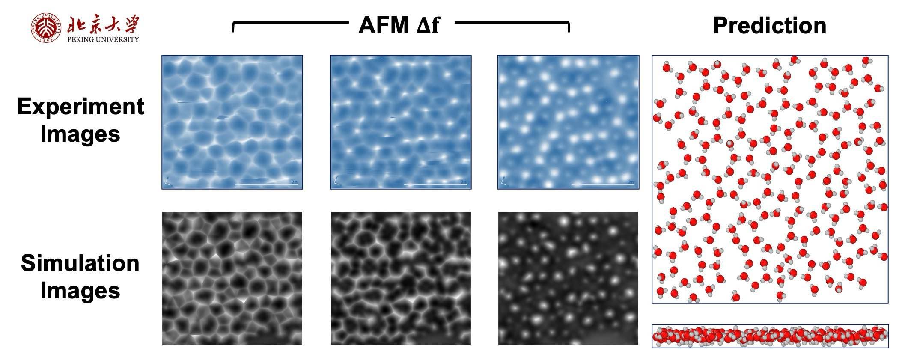

My academic research is mainly focused on machine learning on scientific problems.

# Machine Learning for Computational Studies of Interfacial Water Systems

In the field of solid/liquid interface characterization, we are utilizing Atomic Force Microscopy (AFM) to investigate the behavior of water molecules at the interface between ice crystals and vacuum. While the structure of ice crystals is commonly perceived as straightforward, the water molecules at these interfaces exhibit complex behaviors, such as forming [premelting](https://www.nature.com/articles/s41570-019-0080-8) layers and complex ring systems. By delving into the physics of these layers, we aim to enhance our understanding of the reactivity, crystallization, and interactions of water molecules with other substances.

We've obtained AFM images through simulations and applied neural networks (NN) to uncover the spatial information of water molecules. This method is further extended to real AFM images acquired from our collaborators, focusing on realistic structures. We've also employed several advanced techniques such as Domain Adaptation (DA), and ice-rules adjustment algorithm to bolster the reliability of our experimental findings. The outcomes on realistic AFM images have proven to be highly accurate and reliable.

Furthermore, We are developing generative algorithms, such as utilizing [Equivariant Graph Neural Networks](https://www.sciencedirect.com/science/article/abs/pii/S0950705122001289) (EGNN) and [score-based models](https://arxiv.org/abs/2011.13456). Our ultimate goal is to decode the transition between ice crystals and disordered layers, thereby deepening our understanding of water molecule reactivity and interaction.

# Physics Informed Active Learning

Applications of neural networks in solving PDEs, such as [Physics-Informed Neural Networks](https://www.sciencedirect.com/science/article/abs/pii/S0021999118307125) (PINNs), often require the design of specific networks for each unique problem. This approach can be inefficient, particularly when dealing with a variety of PDEs that have differing parameters or geometries. [DeepONet](https://arxiv.org/abs/1910.03193) offers an innovative solution by breaking down the problem into two interconnected components - the mapping between functions and coordinate variables - utilizing universal approximation theory. However, in tackling some realistic problems, we still encounter several challenges:
- The availability of labeled data is limited due to the time-consuming nature of numerical solvers.
- Data-driven methods often converge faster and with greater accuracy.
- The quality of training data significantly impacts the effectiveness of the neural network.

To address these issues, we propose a method to implement physics-informed active learning, aimed at enhancing the performance of neural networks. Our method, tested on diffusion-reaction equations, advection equations, and Burgers' equations, has shown to reduce the amount of data required, improve stability, and decrease the relative error. We are in the process of developing a theory to elucidate the underlying logic within the neural network. Our ultimate goal is to extend this method into a universal active learning theory.

