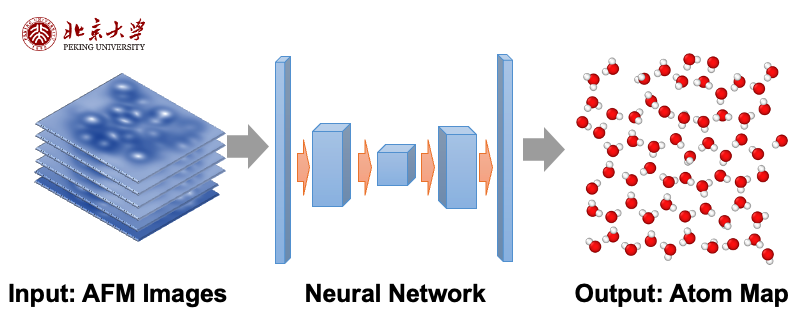

My academic research is mainly focused on machine learning on scientific problems.

# Machine Learning for Computational Studies of Interfacial Water Systems

While the structure of ice crystals is commonly understood as simple, however, the water molecules on the interface between substances and vacuum can be complicated. For example, there will be [pre-melting](https://www.nature.com/articles/s41570-019-0080-8) layers on the surface of ice. In these quasi-liquid layers, water molecules exhibit a disordered state, forming bi-layer structures and rings. Resolving the physics of these layers can help us understand the reactivity, the crystalization, and the interaction with other substances of water molecules.

By utilizing one of the characterization techniques in Solid/Liquid interface - Atomic Force Microscope(AFM). We obtain the AFM images from DFT simulations, using neural networks (NN) to discover the spatial information of water molecules. After that, we apply this method in realistic structures from real AFM images obtained from our collaborators.

The real AFM images often contain noise and unexpected defects. To enhance the accuracy of our data, we apply domain adaptation methods, improving the reliability of the experimental findings. We obtain a very reliable label from the data of experiments. However, only one single layer can be very unstable in simulations, we are still developing generative algorithms (such as utilizing [Equivariant Graph Neural Networks](https://www.sciencedirect.com/science/article/abs/pii/S0950705122001289) on [score-based models](https://arxiv.org/abs/2011.13456)). Our goal is to decode the transition between ice crystals and disordered layers, enhancing our understanding of water molecule reactivity and interaction, which has profound implications in various scientific domains.

# Physics Informed Active Learning

Applications of neural networks in solving PDEs, such as [Physics-Informed Neural Networks](https://www.sciencedirect.com/science/article/abs/pii/S0021999118307125) (PINNs), often require the design of specific networks for each unique problem. This approach can be inefficient, particularly when dealing with a variety of PDEs that have differing parameters or geometries. [DeepONet](https://arxiv.org/abs/1910.03193) offers an innovative solution by breaking down the problem into two interconnected components - the mapping between functions and coordinate variables - utilizing universal approximation theory. However, in tackling some realistic problems, we still encounter several challenges:
- The availability of labeled data is limited due to the time-consuming nature of numerical solvers.
- Data-driven methods often converge faster and with greater accuracy.
- The quality of training data significantly impacts the effectiveness of the neural network.

To address these issues, we propose a method to implement physics-informed active learning, aimed at enhancing the performance of neural networks. Our method, tested on diffusion-reaction equations, advection equations, and Burgers' equations, has shown to reduce the amount of data required, improve stability, and decrease the relative error. We are in the process of developing a theory to elucidate the underlying logic within the neural network. Our ultimate goal is to extend this method into a universal active learning theory.

