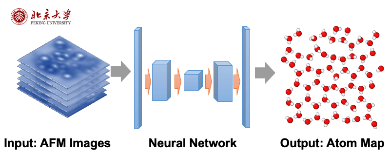
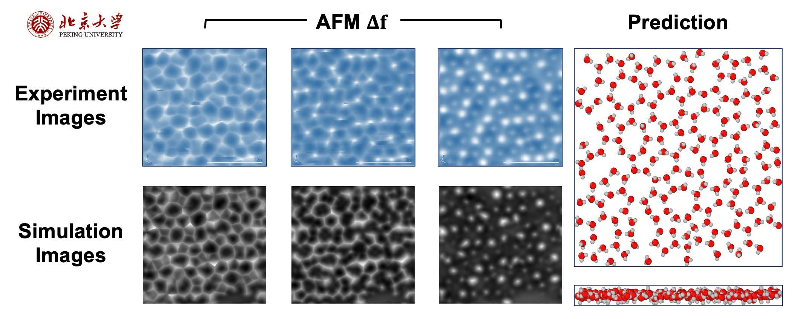

While the structure of ice crystals is commonly understood as simple, however, the water molecules on the interface between substances and vacuum can be very complicated. For example, there will be [pre-melting](https://www.nature.com/articles/s41570-019-0080-8) layers on the surface of ice. In these quasi-liquid layers, water molecules exhibit a disordered state, forming bi-layer structures and rings. Resolving the physics of these layers can help us understand the reactivity, the crystalization, and the interaction with other substances of water molecules.

By utilizing one of the characterization techniques in Solid/Liquid interface - Atomic Force Microscope(AFM). We obtain the AFM images from DFT simulations, using neural networks (NN) to discover the spatial information of water molecules. After that, we use this network to predict some realistic structures from real AFM images obtained from our collaborators.

The real AFM images often contain noise and unexpected defects. To enhance the accuracy of our data, we apply domain adaptation methods, improving the reliability of the experimental findings. We obtain a very reliable label from the data of experiments. However, only one single layer can be very unstable in simulations, we are still developing generative algorithms (such as utilizing [Equivariant Graph Neural Networks](https://www.sciencedirect.com/science/article/abs/pii/S0950705122001289) on [score-based models](https://arxiv.org/abs/2011.13456)). Our goal is to decode the transition between ice crystals and disordered layers, enhancing our understanding of water molecule reactivity and interaction, which has profound implications in various scientific domains.

